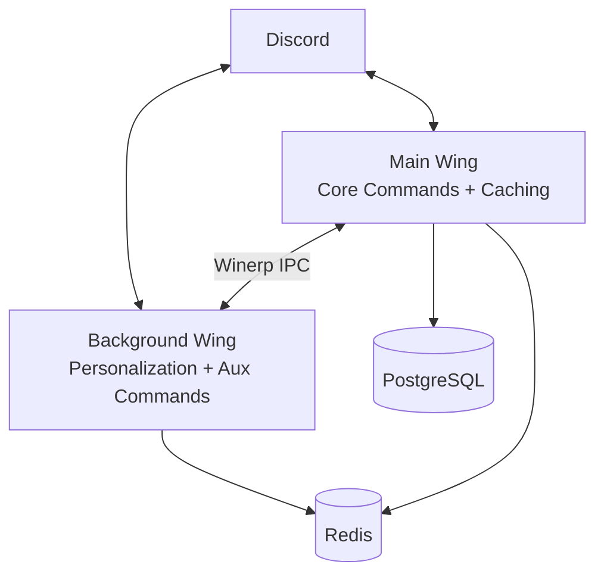
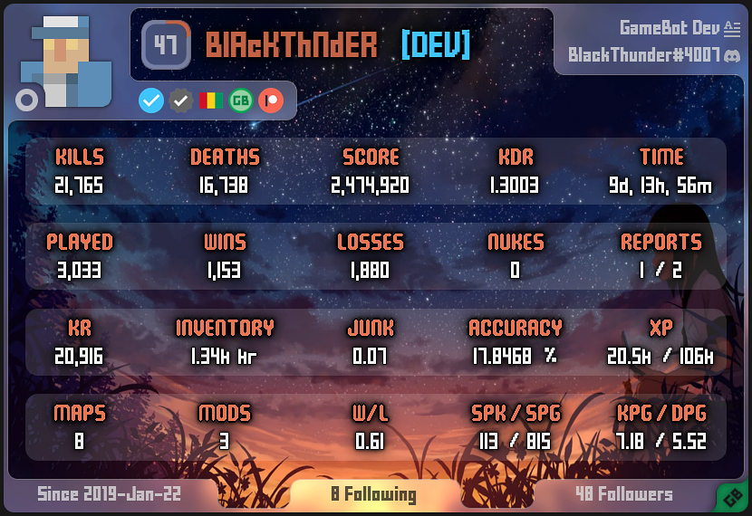
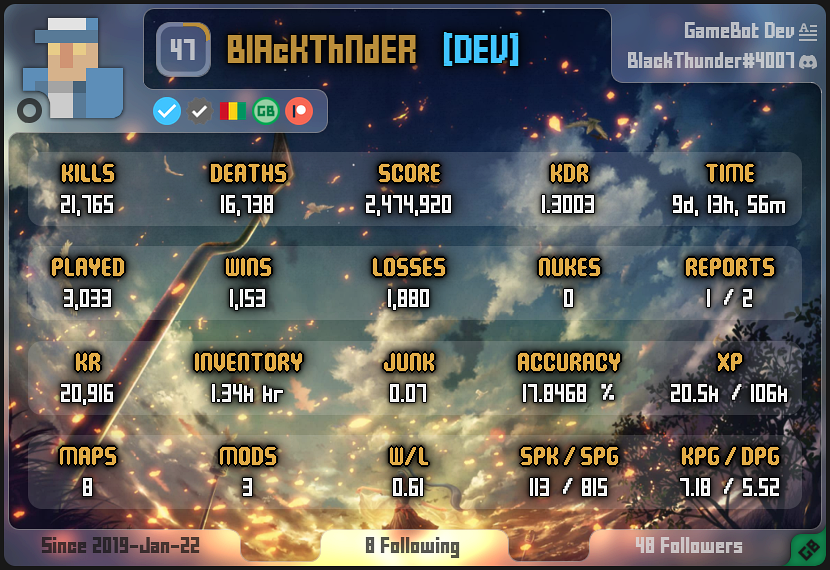

# GameBot

A Discord bot for [Krunker](https://krunker.io) that lets players link their in-game accounts and view detailed stat profiles directly in Discord.

---

## Overview

[GameBot](https://discord.com/discovery/applications/717416553099952219) is a Discord bot built for the Krunker community. Players link their Krunker accounts to Discord and can instantly retrieve rich, image-based stat cards covering kills, deaths, KDR, accuracy, W/L ratio, XP, playtime, and more.

Built and maintained solo since June 2020, the bot has grown to over 9,400 Discord servers and 40,500 linked user accounts.

---

## Features

- **Player Profiles** -- Link Krunker accounts to Discord and retrieve stat cards on demand
- **Stat Tracking** -- Kills, deaths, KDR, score, accuracy, W/L ratio, nukes, XP, playtime, maps, and modes
- **Image Generation** -- Stats rendered as formatted image cards and sent directly in Discord
- **Multi-account Support** -- Link multiple Krunker accounts per Discord user with a configurable main account

---

## Tech Stack

| Layer | Technology |
|---|---|
| Language | Python |
| Discord Library | discord.py |
| Database | PostgreSQL + Redis |
| Image Generation | Pillow / PIL |
| IPC | [Winerp](https://pypi.org/project/winerp/) |
| Infrastructure | Dedicated VPS |

---

## Architecture

The bot runs as two decoupled processes, both maintaining a direct connection to Discord via discord.py and communicating with each other through [Winerp](https://pypi.org/project/winerp/), a custom WebSocket IPC library built for this project.

The Main wing handles all core commands and is the only process with PostgreSQL access and caching enabled. The Background wing handles personalization and auxiliary commands in isolation, keeping non-critical logic out of the core path. discord.py acquires a lock on file sends that blocks the async event loop. Isolating image and GIF processing in a separate process with its own Discord connection ensures this lock never stalls core command handling in the Main Wing.

**Performance:**
- Image generation time reduced from 8s to 0.4s via a multithreaded processing pipeline (20x improvement)
- IPC response time under 2ms via Winerp
- Infrastructure managed on a self-hosted VPS

---

## Preview

  
  

---

## Related

**[Winerp](https://github.com/nouman0103/winerp)** -- The open-source Python IPC library designed originally for this project. Published on PyPI with 50,000+ downloads and 13 GitHub stars.

---

## Author

**M. Nouman Iqbal**

